# Report [Team 12] : Modul 4 - Load Balancer

## Case Study

- Application of a load balancer for /blog and /app with the following conditions:

  - / (landing page) using **round robin**

  - /blog using **least_conn**

  - /app using **ip hash**


## Problem Solving

- **Preparing for landing page**

  - First, we need to clone  **lxc_landing** to **lxc_landing_2** and **lxc_landing_3**. Before we clone the lxc, we need to stop the lxc first using command `sudo lxc-stop -n ubuntu_landing`. After that, type the command as below to clone the **lxc_landing**. 

    ```
     sudo lxc-copy -n ubuntu_landing -N ubuntu_landing_2 -sKD
     sudo lxc-copy -n ubuntu_landing -N ubuntu_landing_3 -sKD
    ```

  - Start all of the **lxc_landing** using command as below.

    ```
     sudo lxc-start -n ubuntu_landing
     sudo lxc-start -n ubuntu_landing_2
     sudo lxc-start -n ubuntu_landing_3
    ```

  - Than, we will make some configuration in each **lxc_landing_2** and **lxc_landing_3** that have we made.

  - Type `sudo lxc-attach -n ubuntu_landing_2` to enter into **ubuntu_landing_2**.

  - Configuration step for **ubuntu_landing_2**.

    - First, we will set the IP of **ubuntu_landing_2**. Type `nano /etc/netplan/10-lxc.yaml` to setting the IP from **10.0.3.103** to **10.0.3.113**. Than, type `netplan apply` to apply all changes that have we made.

      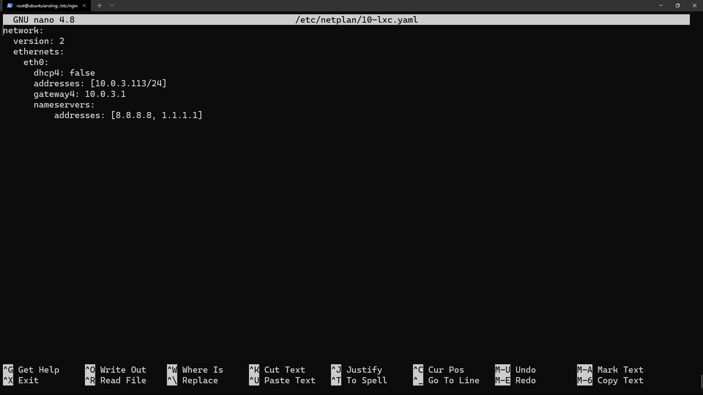

    - We can check the IP was changed or not by type `ip addr show eth0`. As we can see in the picture, our IP was successfully changed to **10.0.3.113**.

      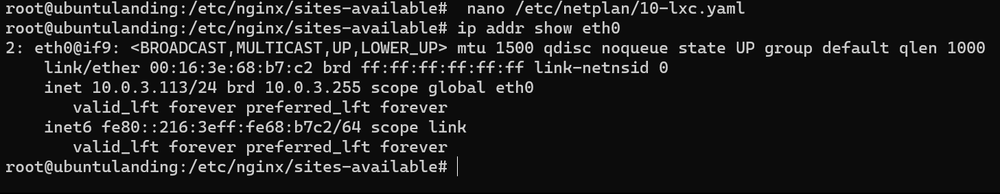

    - Now, we need to register the **lxc_landing_2.dev** domain in the hosts file by type `nano /etc/hosts`.

      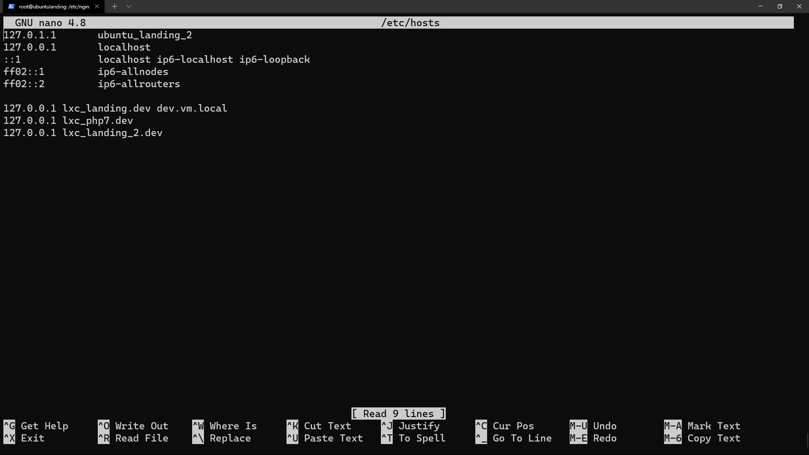

    - Than, go to the **sites-available** directory by type `cd /etc/nginx/sites-available` and enter to **lxc_landing.dev** by type `nano lxc_landing.dev`. In this file, we just need to change the server_name from **lxc_landing.dev** to **lxc_landing_2.dev** than save it. 

      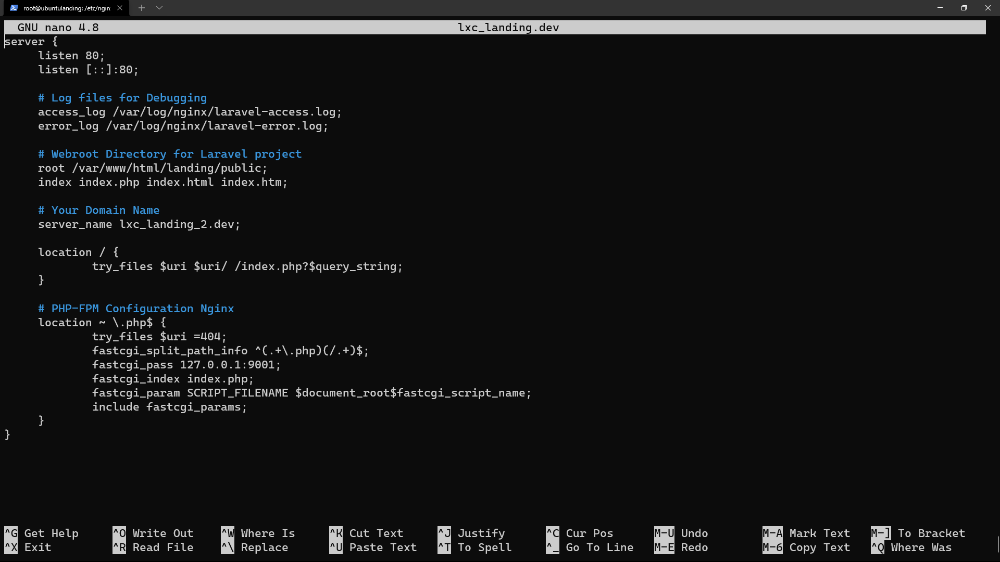

    - Type `nginx -t` to check that our syntax was right and type `service nginx restart` to restart the service of nginx.

    - Now we can check all of our configuration was running well or not by type `curl -i http://lxc_landing_2.dev`.

      

  - Type `sudo lxc-attach -n ubuntu_landing_3` to enter into **ubuntu_landing_3**.

  - Configuration step for **ubuntu_landing_3**.

    - First, we will set the IP of **ubuntu_landing_3**. Type `nano /etc/netplan/10-lxc.yaml` to setting the IP from **10.0.3.103** to **10.0.3.123**. Than, type `netplan apply` to apply all changes that have we made.

      

    - We can check the IP was changed or not by type `ip addr show eth0`. As we can see in the picture, our IP was successfully changed to **10.0.3.123**.

      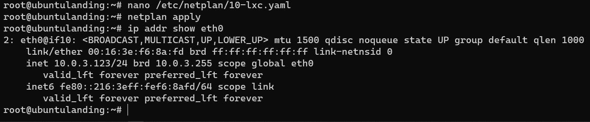

    - Now, we need to register the **lxc_landing_3.dev** domain in the hosts file by type `nano /etc/hosts`.

      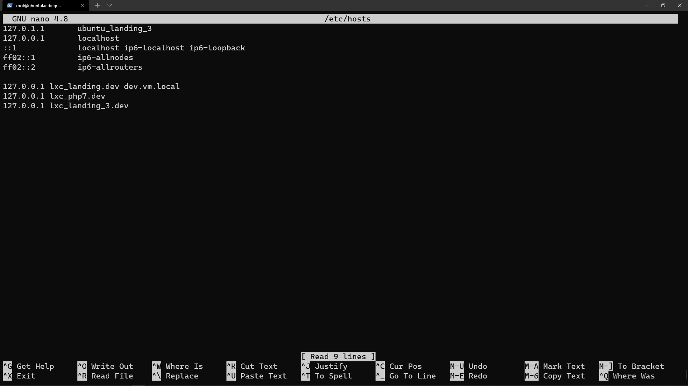

    - Than, go to the **sites-available** directory by type `cd /etc/nginx/sites-available` and enter to **lxc_landing.dev** by type `nano lxc_landing.dev`. In this file, we just need to change the server_name from **lxc_landing.dev** to **lxc_landing_3.dev** than save it. 

      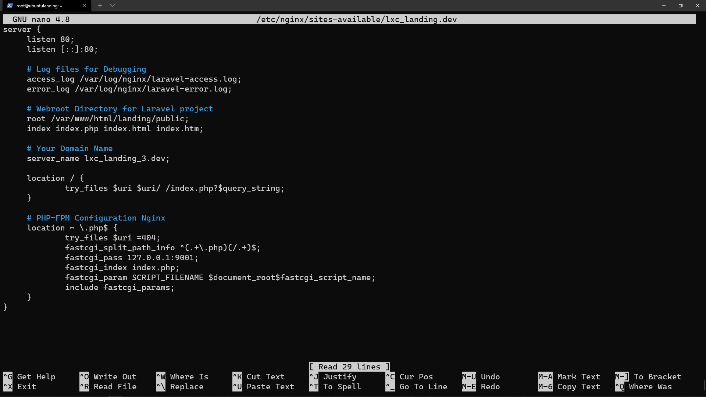

    - Type `nginx -t` to check that our syntax was right and type `service nginx restart` to restart the service of nginx.

    - Now we can check all of our configuration was running well or not by type `curl -i http://lxc_landing_3.dev`.

      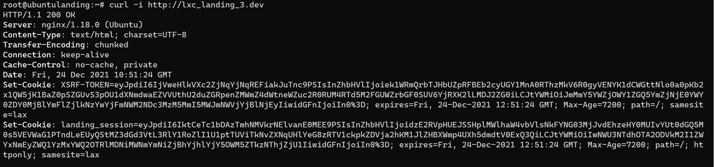

- **Preparing for blog page**

  - First, we need to clone  **ubuntu_php7.4** to **ubuntu_php7.4_2** and **ubuntu_php7.4_3**. Before we clone the lxc, we need to stop the lxc first using command `sudo lxc-stop -n ubuntu_php7.4`. After that, type the command as below to clone the **ubuntu_php7.4**. 

    ```
     sudo lxc-copy -n ubuntu_php7.4 -N ubuntu_php7.4_2 -sKD
     sudo lxc-copy -n ubuntu_php7.4 -N ubuntu_php7.4_3 -sKD
    ```

  - Start all of the **ubuntu_php7.4** using command as below.

    ```
     sudo lxc-start -n ubuntu_php7.4
     sudo lxc-start -n ubuntu_php7.4_2
     sudo lxc-start -n ubuntu_php7.4_3
    ```

  - Than, we will make some configuration in each **ubuntu_php7.4_2** and **ubuntu_php7.4_3** that have we made.

  - Type `sudo lxc-attach -n ubuntu_php7.4_2` to enter into **ubuntu_php7.4_2**.

  - Configuration step for **ubuntu_php7.4_2**.

    - First, we will set the IP of **ubuntu_php7.4_2**. Type `nano /etc/netplan/10-lxc.yaml` to setting the IP from **10.0.3.101** to **10.0.3.111**. Than, type `netplan apply` to apply all changes that have we made.

      

    - We can check the IP was changed or not by type `ip addr show eth0`. As we can see in the picture, our IP was successfully changed to **10.0.3.111**.

      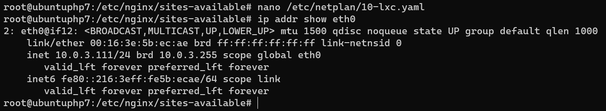

    - Now, we need to register the **lxc_php7_2.dev** domain in the hosts file by type `nano /etc/hosts`.

      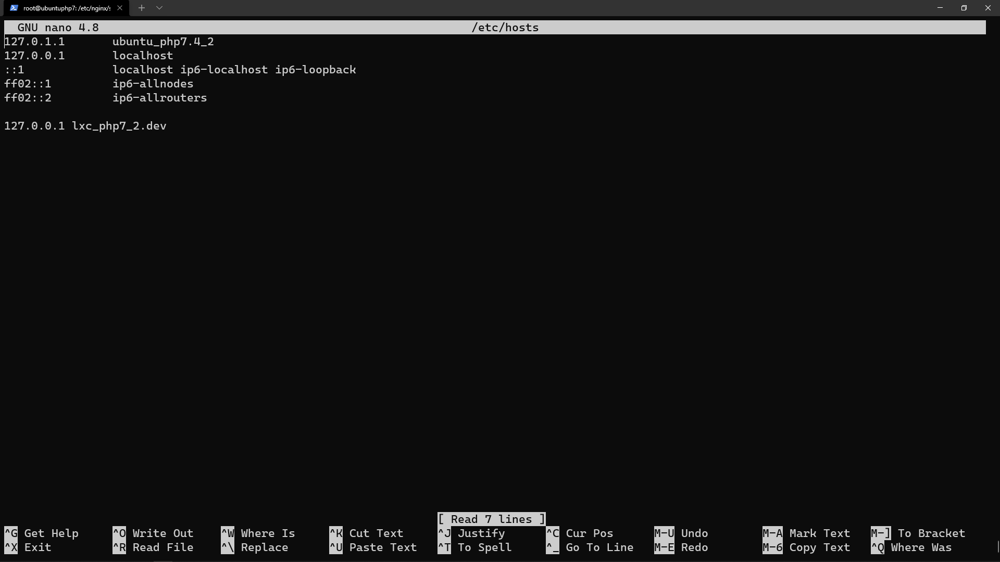

    - Than, go to the **sites-available** directory by type `cd /etc/nginx/sites-available` and enter to **lxc_php7.dev** by type `nano lxc_php7.dev`. In this file, we just need to change the server_name from **lxc_php7.dev** to **lxc_php7_2.dev** than save it. 

      

    - Type `nginx -t` to check that our syntax was right and type `service nginx restart` to restart the service of nginx.

    - Now we can check all of our configuration was running well or not by type `curl -i http://lxc_php7_2.dev`.

      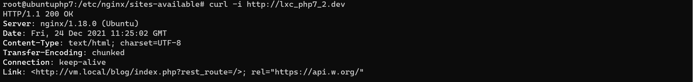

  - Type `sudo lxc-attach -n ubuntu_php7.4_3` to enter into **ubuntu_php7.4_3**.

  - Configuration step for **ubuntu_php7.4_3**.

    - First, we will set the IP of **ubuntu_php7.4_3**. Type `nano /etc/netplan/10-lxc.yaml` to setting the IP from **10.0.3.101** to **10.0.3.121**. Than, type `netplan apply` to apply all changes that have we made.

      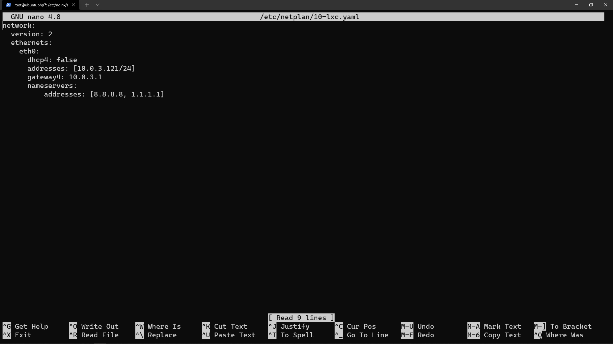

    - We can check the IP was changed or not by type `ip addr show eth0`. As we can see in the picture, our IP was successfully changed to **10.0.3.121**.

      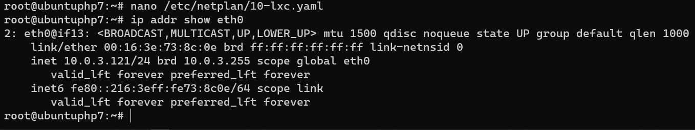

    - Now, we need to register the **lxc_php7_3.dev** domain in the hosts file by type `nano /etc/hosts`.

      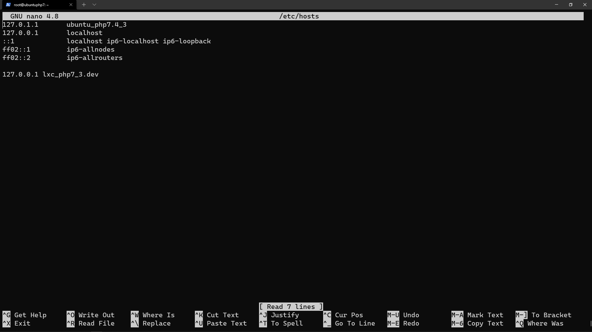

    - Than, go to the **sites-available** directory by type `cd /etc/nginx/sites-available` and enter to **lxc_php7.dev** by type `nano lxc_php7.dev`. In this file, we just need to change the server_name from **lxc_php7.dev** to **lxc_php7_3.dev** than save it. 

      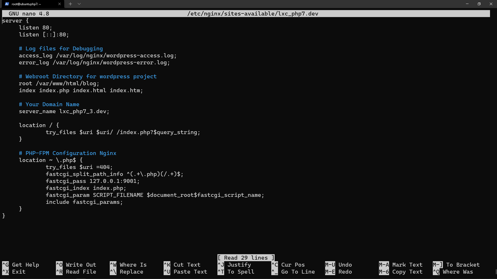

    - Type `nginx -t` to check that our syntax was right and type `service nginx restart` to restart the service of nginx.

    - Now we can check all of our configuration was running well or not by type `curl -i http://lxc_php7_3.dev`.

      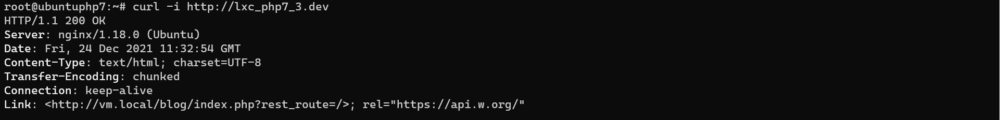

- **Preparing for app page**

  - First, we need to clone  **debian_php5.6** to **debian_php5.6_2** and **debian_php5.6_3**. Before we clone the lxc, we need to stop the lxc first using command `sudo lxc-stop -n debian_php5.6`. After that, type the command as below to clone the **debian_php5.6**. 

    ```
     sudo lxc-copy -n debian_php5.6 -N debian_php5.6_2 -sKD
     sudo lxc-copy -n debian_php5.6 -N debian_php5.6_3 -sKD
    ```

  - Start all of the **lxc_landing** using command as below.

    ```
     sudo lxc-start -n debian_php5.6
     sudo lxc-start -n debian_php5.6_2
     sudo lxc-start -n debian_php5.6_3
    ```

  - Than, we will make some configuration in each **debian_php5.6_2** and **debian_php5.6_3** that have we made.

  - Type `sudo lxc-attach -n debian_php5.6_2` to enter into **debian_php5.6_2**.

  - Configuration step for **debian_php5.6_2**.

    - First, we will set the IP of **debian_php5.6_2**. Type `nano /etc/network/interfaces` to setting the IP from **10.0.3.102** to **10.0.3.112**. Than, type `systemctl restart networking.service` to apply all changes that have we made.

      

    - We can check the IP was changed or not by type `ip addr show eth0`. As we can see in the picture, our IP was successfully changed to **10.0.3.112**.

      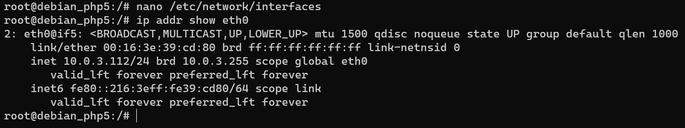

    - Now, we need to register the **lxc_php5_2.dev** domain in the hosts file by type `nano /etc/hosts`.

      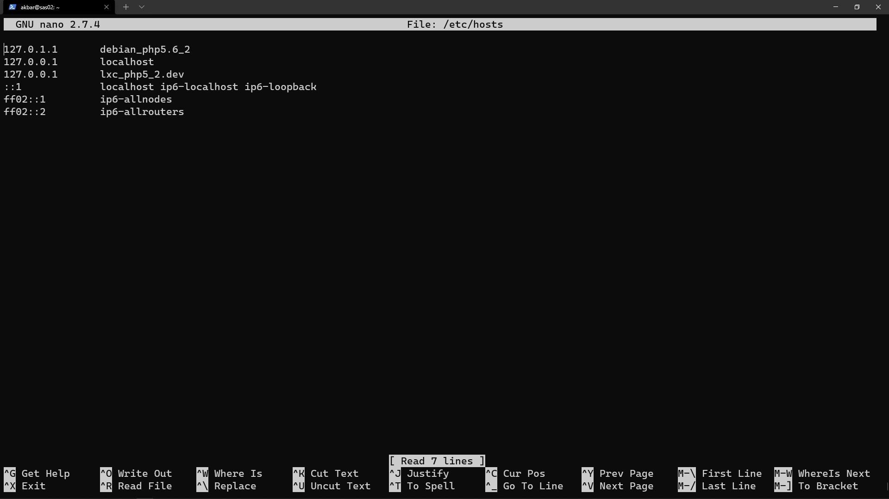

    - Than, go to the **sites-available** directory by type `cd /etc/nginx/sites-available` and enter to **lxc_php5.dev** by type `nano lxc_php5.dev`. In this file, we just need to change the server_name from **lxc_php5.dev** to **lxc_php5_2.dev** than save it. 

      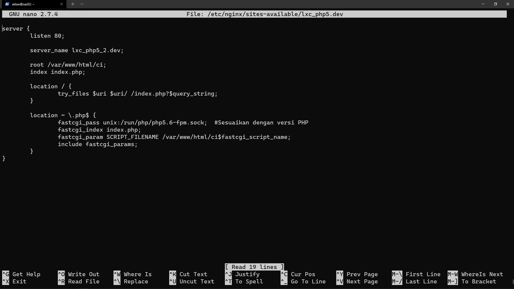

    - Type `nginx -t` to check that our syntax was right and type `service nginx restart` to restart the service of nginx.

    - Now we can check all of our configuration was running well or not by type `curl -i http://lxc_php5_2.dev`.

      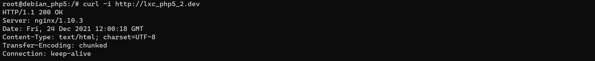

  - Type `sudo lxc-attach -n debian_php5.6_3` to enter into **debian_php5.6_3**.

  - Configuration step for **debian_php5.6_3**.

    - First, we will set the IP of **debian_php5.6_3**. Type `nano /etc/network/interfaces` to setting the IP from **10.0.3.102** to **10.0.3.122**. Than, type `systemctl restart networking.service` to apply all changes that have we made.

      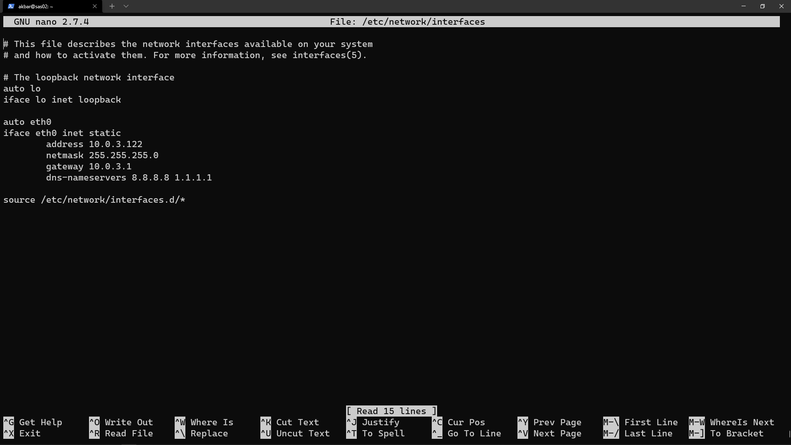

    - We can check the IP was changed or not by type `ip addr show eth0`. As we can see in the picture, our IP was successfully changed to **10.0.3.122**.

      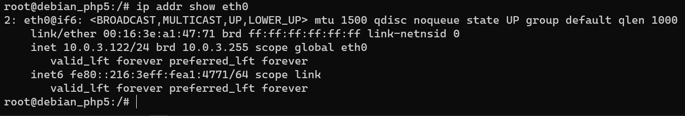

    - Now, we need to register the **lxc_php5_3.dev** domain in the hosts file by type `nano /etc/hosts`.

      

    - Than, go to the **sites-available** directory by type `cd /etc/nginx/sites-available` and enter to **lxc_php5.dev** by type `nano lxc_php5.dev`. In this file, we just need to change the server_name from **lxc_php5.dev** to **lxc_php5_3.dev** than save it. 

      

    - Type `nginx -t` to check that our syntax was right and type `service nginx restart` to restart the service of nginx.

    - Now we can check all of our configuration was running well or not by type `curl -i http://lxc_php5_3.dev`.

      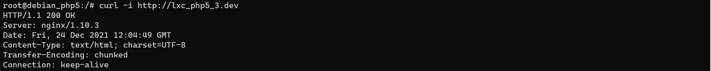

- **Setup nginx on vm.local**

  - Now, we need to register all of lxc that we have made to **hosts** in **vm.local**. Type `sudo nano /etc/hosts` to enter **hosts** file, then type the name and IP of all the lxc that we have created.

    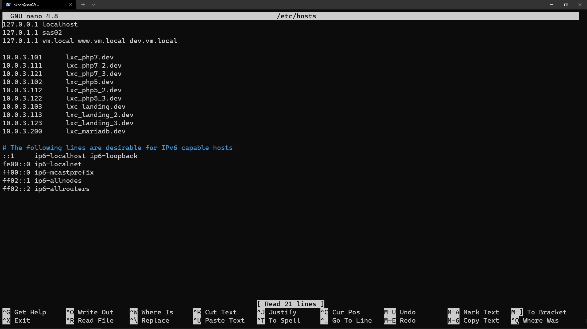

  - Check all of lxc that we have made using curl to make sure all of that running properly without error.

    ```
    curl -I http://lxc_landing_2.dev
    curl -I http://lxc_landing_3.dev
    curl -I http://lxc_php7_2.dev
    curl -I http://lxc_php7_3.dev
    curl -I http://lxc_php5_2.dev
    curl -I http://lxc_php5_3.dev
    ```

    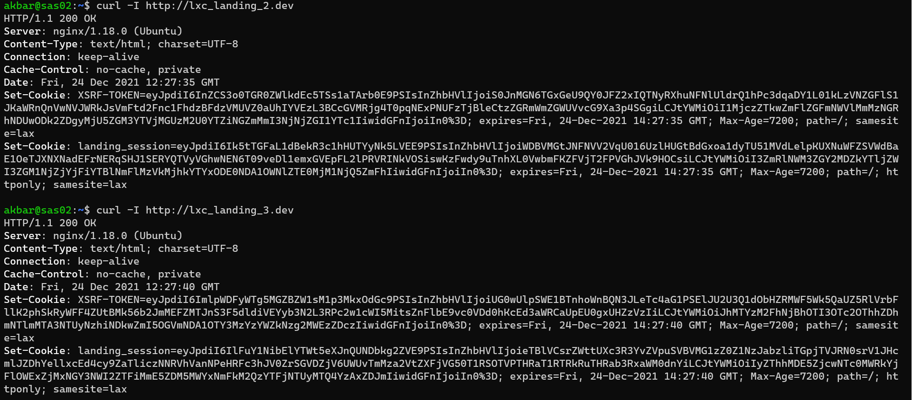

    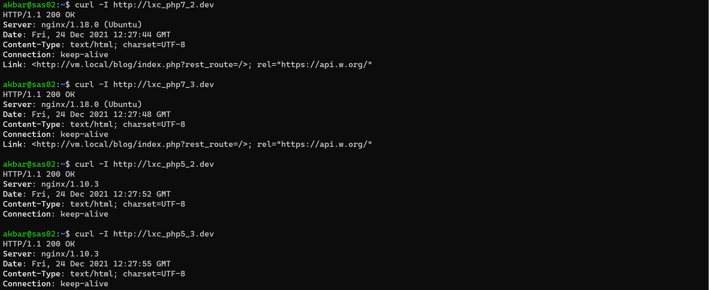

  - Now, we can configure in nginx for the load balancer according to the existing provisions. Go to **sites-available** directory by type `cd /etc/nginx/sites-available` and type `sudo nano vm.local` to enter the **vm.local** file. After that, add some scripts like in the picture below.

    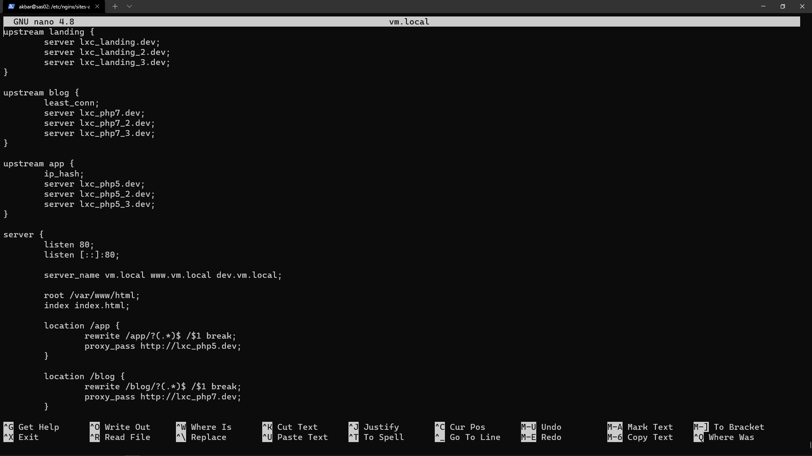

  - Save it, than type `sudo nginx -t` to check that syntax, than reload the nginx by type `sudo service nginx restart`.

  - Try to access the **vm.local** by type `curl -I http://vm.local` to make sure all of our configuration was running properly without mistake.

    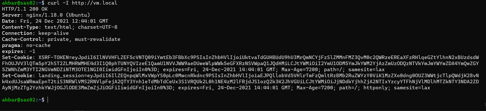

- After that, we can open **JMeter** to start analyze the difference between using a load balancer and not using a load balancer.

  - 50 Users without load balancer

    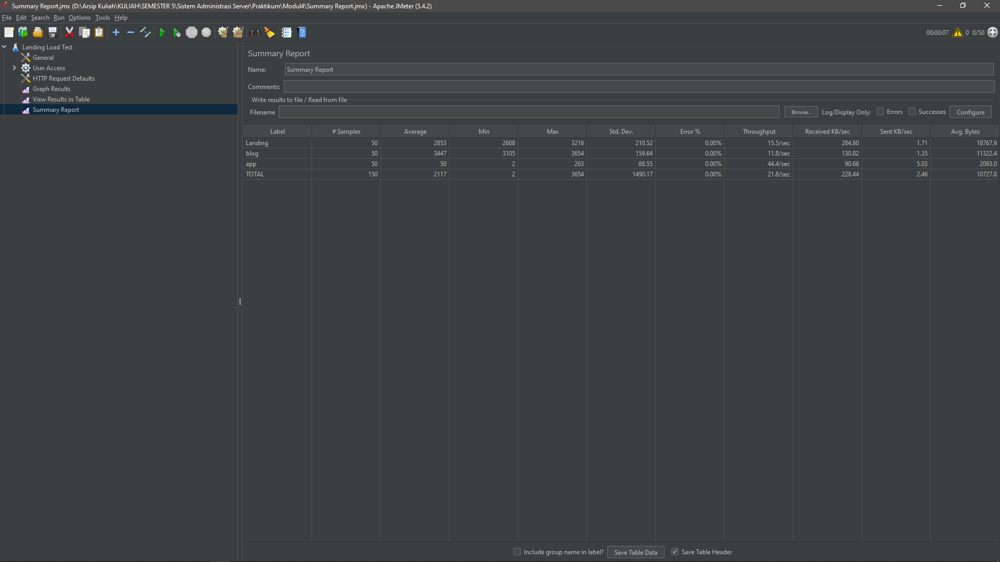

  - 50 Users with load balancer

    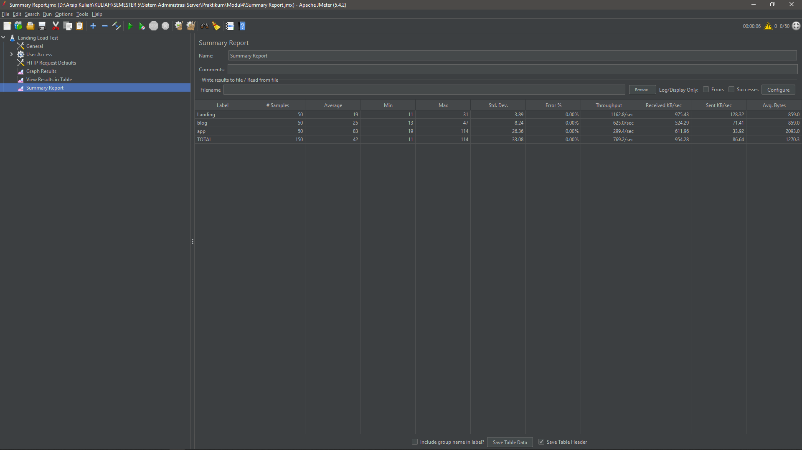

  - 100 Users without load balancer

    

  - 100 Users with load balancer

    

  - 150 Users without load balancer

    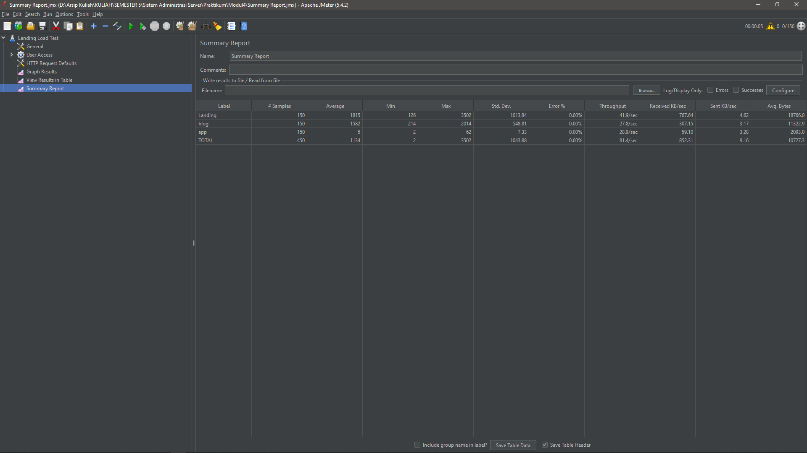

  - 150 Users with load balancer

    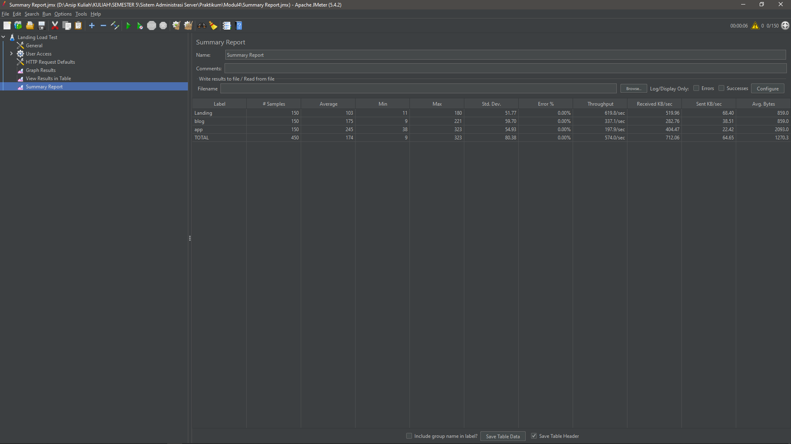
    
    

  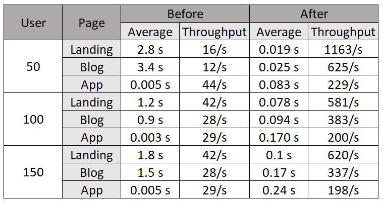

  

- As we can see in the picture, that there is a significant difference between using a load balancer and without a load balancer, which we can see in the summary report for the total section. before using the load balancer, the total time generated from each section is quite high for each traffic, either 50, 100, or 150. After using the load balancer, the total time generated by each section drops drastically. This happens because nginx will always check which server has a light load capacity, so that the next access load will be given to that server and make the proxy server process for each user who is accessing the page faster.

  

##  Created By Team 12 [IT - 02 - 02]
- Muhammad Akbar Ramadhan [1202190019]
- Wiranti Maharani [1202190030]
